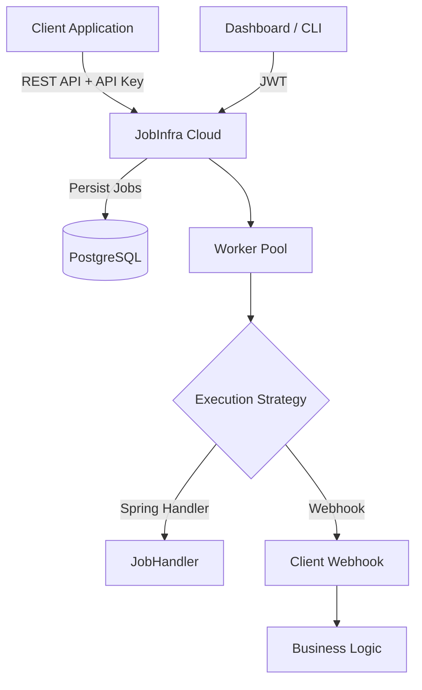

# JobInfra Cloud

JobInfra Cloud is a high-performance, multi-tenant background job orchestration platform and REST API service. It allows developers to offload background tasks through a simple REST API while JobInfra manages persistence, scheduling, secure dispatch, and lifecycle tracking.

JobInfra supports two execution models:
- **Spring Handler Execution** for Spring Boot applications.
- **Webhook Execution** for any language or framework capable of receiving HTTP requests (Next.js, Express, Django, FastAPI, Laravel, Go, etc.).

## Overview

JobInfra is designed to be developer-first. It handles the heavy lifting of state management, persistence, scheduling, and secure execution orchestration for your background tasks, allowing you to focus on building business logic rather than infrastructure.

## Execution Model

JobInfra Cloud **does not execute your business logic**.

Instead, it acts as a background job orchestrator.

The execution flow is:

```text
Your Application
        │
        ▼
Submit Job
        │
        ▼
JobInfra Cloud
(Persist + Queue)
        │
        ▼
Worker Thread
        │
        ▼
Execution Strategy
        │
        ├───────────────┐
        ▼               ▼
Spring Handler     Webhook Dispatch
                        │
                        ▼
             Your Application executes
             the business logic
```

Your application owns the business logic.

JobInfra is responsible for:

- Persisting jobs
- Scheduling execution
- Dispatching jobs
- Tracking lifecycle
- Monitoring execution
- Secure webhook delivery

---

## Architecture



- **jobinfra-spring-boot-starter**: The core execution engine and worker infrastructure.
- **jobinfra-server**: The multi-tenant REST API layer providing authentication, project management, API key management, persistence, and orchestration.

## Features

- **Project Isolation**: Logical separation of jobs using Projects.
- **Secure API Keys**: Prefix-identifiable (`ji_live_`, `ji_test_`), securely hashed API keys via SHA-256 constant-time evaluation.
- **Multiple Execution Models**: Execute jobs using Spring Handlers or Webhooks.
- **Complete Job Lifecycle**: Granular statuses (`CREATED`, `QUEUED`, `RUNNING`, `SUCCESS`, `FAILED`, `CANCELLED`) and precise timestamps.
- **Robust Security**: Rate limiting, XSS protection, CSP Headers, HMAC-signed webhooks, and comprehensive global exception handling.
- **Observability**: MDC Request Correlation (`X-Request-ID`), structured logging, and health metrics endpoints.
- **OpenAPI / Swagger**: Interactive API documentation generated dynamically.

---

## Quick Start

### Docker Setup

The fastest way to get JobInfra Cloud running is using Docker.

```bash
git clone https://github.com/Sairaj182/JobInfraPluggable.git
cd JobInfraPluggable/docker
docker-compose up --build
```

This spins up both the JobInfra Server on `http://localhost:8080` and a PostgreSQL database on `5432`.

### Local Development

If you prefer running it locally via Maven:

1. Create an `.env` file from `.env.example`.
2. Start your local PostgreSQL instance or run `docker-compose up db -d`.
3. Build and run:

```bash
./mvnw clean install
cd jobinfra-server
./mvnw spring-boot:run
```

---

## Exploring the API

Once running, navigate to `http://localhost:8080/swagger-ui/index.html` to view the comprehensive, interactive OpenAPI documentation.

### 1. Authentication (Register User)

```bash
curl -X POST http://localhost:8080/api/v1/auth/register \
     -H "Content-Type: application/json" \
     -d '{"username": "demo_user", "password": "secure_password"}'
```

### 2. Authentication (Login)

```bash
curl -X POST http://localhost:8080/api/v1/auth/login \
     -H "Content-Type: application/json" \
     -d '{"username": "demo_user", "password": "secure_password"}'
```

*Note the returned `token` (JWT).*

### 3. Creating a Project

```bash
curl -X POST http://localhost:8080/api/v1/projects \
     -H "Authorization: Bearer <YOUR_JWT_TOKEN>" \
     -H "Content-Type: application/json" \
     -d '{"name": "Email Processing"}'
```

*Note the returned `projectId`.*

### 4. Generating API Keys

```bash
curl -X POST http://localhost:8080/api/v1/projects/<PROJECT_ID>/keys \
     -H "Authorization: Bearer <YOUR_JWT_TOKEN>" \
     -H "Content-Type: application/json" \
     -d '{"description": "Production Key"}'
```

*Copy the `rawKey` (e.g. `ji_live_123...`). This is the **only** time the raw key will be shown.*

### 5. Submitting Jobs

```bash
curl -X POST http://localhost:8080/api/v1/jobs \
     -H "X-API-KEY: ji_live_YOUR_RAW_KEY" \
     -H "Content-Type: application/json" \
     -d '{"handlerName": "emailHandler", "payload": "{\"to\": \"user@example.com\"}"}'
```

### 6. Fetching Jobs

```bash
curl -X GET http://localhost:8080/api/v1/jobs \
     -H "X-API-KEY: ji_live_YOUR_RAW_KEY"
```

---

## Example Walkthrough: Next.js Integration (Webhook Execution)

Suppose you are building a **Next.js** application and need a background job to handle user onboarding: sending a welcome email, generating an OTP, and sending a welcome SMS.

Because JobInfra handles **job persistence, scheduling, dispatch, and lifecycle tracking**, your Next.js application doesn't need to manage background workers or queue infrastructure. Instead, it submits a job to JobInfra, which later invokes your webhook when the job is ready for execution.

When a worker picks up the queued job, JobInfra sends an HTTP POST request to your webhook URL. **The webhook runs inside your own application**, executes your business logic, and returns an HTTP response. JobInfra then updates the job status based on that response.

### Step 1: Create a Webhook Endpoint in Next.js

Define an API route that JobInfra will invoke.

```typescript
// app/api/webhooks/onboarding/route.ts
import crypto from 'crypto';

export async function POST(request: Request) {
  const bodyText = await request.text();
  const signature = request.headers.get("X-JobInfra-Signature");

  // 1. Verify Authenticity (HMAC-SHA256)
  const secret = process.env.JOBINFRA_WEBHOOK_SECRET || "default_secret_please_change";
  const expectedSignature = crypto.createHmac('sha256', secret).update(bodyText).digest('hex');

  if (signature !== expectedSignature) {
    return Response.json({ error: "Invalid signature" }, { status: 401 });
  }

  // 2. Execute your business logic
  const webhookEvent = JSON.parse(bodyText);
  const payload = JSON.parse(webhookEvent.payload);

  console.log(`Processing Job ${webhookEvent.jobId} for project ${webhookEvent.projectId}`);

  // Your business logic
  // sendWelcomeEmail(payload.email);
  // generateOTP(payload.phone);
  // sendWelcomeSMS(payload.phone);

  // Returning 2xx tells JobInfra the job completed successfully.
  return Response.json({ success: true });
}
```

### Step 2: Submit a Job from Next.js

```typescript
// app/api/register/route.ts
export async function POST(request: Request) {
  const user = await request.json();

  const jobRequest = {
    executionType: "WEBHOOK",
    webhookUrl: "https://your-domain.com/api/webhooks/onboarding",
    webhookHeaders: {
      "X-Custom-Header": "MyValue"
    },
    payload: JSON.stringify({
      email: user.email,
      phone: user.phone
    })
  };

  const response = await fetch("http://localhost:8080/api/v1/jobs", {
    method: "POST",
    headers: {
      "Content-Type": "application/json",
      "X-API-KEY": process.env.JOBINFRA_API_KEY!
    },
    body: JSON.stringify(jobRequest)
  });

  const { data: jobId } = await response.json();

  return Response.json({
    success: true,
    jobId
  });
}
```

---

## Deployment

JobInfra Cloud can be deployed using Docker on any cloud provider.

A typical production deployment consists of:

- JobInfra Cloud
- PostgreSQL
- Reverse Proxy (Nginx)
- HTTPS (Let's Encrypt or Cloud Load Balancer)

The platform is suitable for deployment on AWS EC2, ECS, Fargate, App Runner, Kubernetes, or any Docker-compatible environment.

Ensure all environment variables defined in `.env.example` are securely injected at runtime.

---

## Future Roadmap

- Redis Queues and Distributed Workers.
- Webhook Retry Engine with Exponential Backoff.
- Client SDKs for Node.js, Python, and Go.
- Automated Dead Letter Queues (DLQ).
- Dedicated UI Dashboard.


<details open>
<summary><strong>Next.js</strong></summary>

### 1. Webhook Endpoint

```ts
// Next.js code
```

### 2. Submit Job

```ts
// Next.js submit code
```

</details>

<details>
<summary><strong>Flask</strong></summary>

### 1. Webhook Endpoint

```python
from flask import Flask, request, jsonify
import hmac
import hashlib
import json
import os

app = Flask(__name__)

@app.post("/api/webhooks/onboarding")
def onboarding():
    body = request.data
    signature = request.headers.get("X-JobInfra-Signature")

    expected = hmac.new(
        os.environ["JOBINFRA_WEBHOOK_SECRET"].encode(),
        body,
        hashlib.sha256
    ).hexdigest()

    if not hmac.compare_digest(signature, expected):
        return jsonify({"error": "Invalid signature"}), 401

    event = json.loads(body)

    payload = json.loads(event["payload"])

    print(payload["email"])

    # send_email(payload["email"])
    # send_sms(payload["phone"])

    return jsonify(success=True)
```

### 2. Submit Job

```python
import requests
import json
import os

requests.post(
    "https://api.jobinfra.dev/api/v1/jobs",
    headers={
        "X-API-KEY": os.environ["JOBINFRA_API_KEY"]
    },
    json={
        "executionType":"WEBHOOK",
        "webhookUrl":"https://myapp.com/api/webhooks/onboarding",
        "payload":json.dumps({
            "email":"john@gmail.com",
            "phone":"9999999999"
        })
    }
)
```

</details>

<details>
<summary><strong>Express.js</strong></summary>

### 1. Webhook Endpoint

```javascript
import express from "express";
import crypto from "crypto";

const app = express();

app.use(express.text());

app.post("/api/webhooks/onboarding",(req,res)=>{

    const signature=req.header("X-JobInfra-Signature");

    const expected=crypto
        .createHmac("sha256",process.env.JOBINFRA_WEBHOOK_SECRET)
        .update(req.body)
        .digest("hex");

    if(signature!==expected)
        return res.status(401).json({error:"Invalid Signature"});

    const event=JSON.parse(req.body);

    const payload=JSON.parse(event.payload);

    console.log(payload.email);

    // sendEmail()
    // sendSMS()

    res.json({success:true});
});
```

### 2. Submit Job

```javascript
await fetch("https://api.jobinfra.dev/api/v1/jobs",{
    method:"POST",
    headers:{
        "Content-Type":"application/json",
        "X-API-KEY":process.env.JOBINFRA_API_KEY
    },
    body:JSON.stringify({
        executionType:"WEBHOOK",
        webhookUrl:"https://myapp.com/api/webhooks/onboarding",
        payload:JSON.stringify({
            email:"john@gmail.com",
            phone:"9999999999"
        })
    })
});
```

</details>