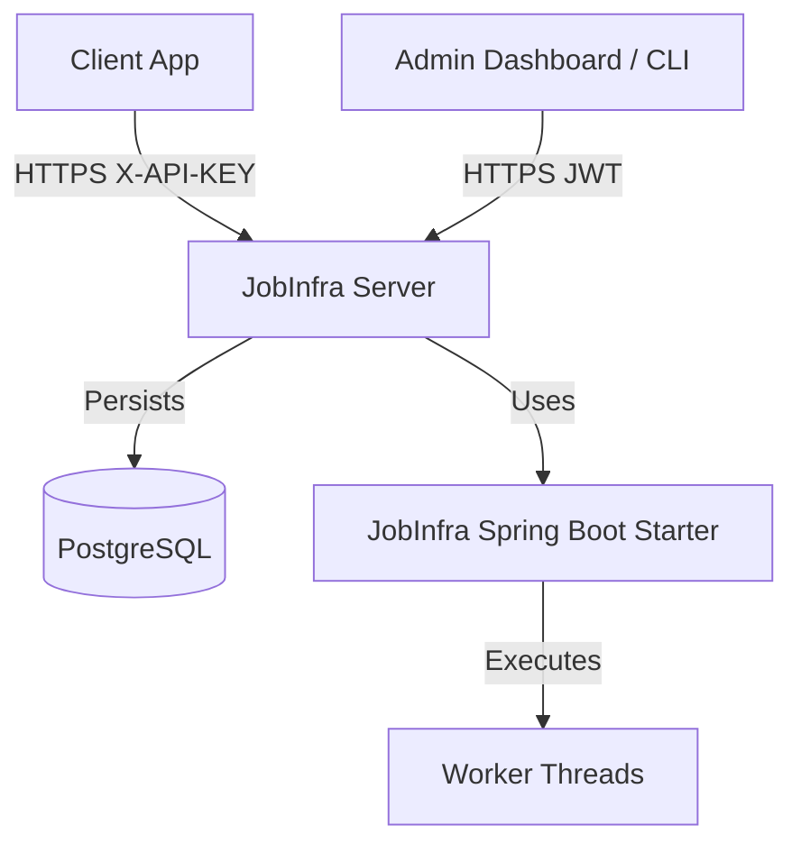

# JobInfra Cloud 🚀

JobInfra Cloud is a high-performance, plug-and-play background job processing engine and REST API service. It allows developers to offload, monitor, and execute background tasks seamlessly using API keys for secure multi-tenant project separation.

## Overview

JobInfra is designed to be developer-first. It handles the heavy lifting of state management, persistence, and secure multitenant execution for your background tasks, allowing you to focus on building features rather than infrastructure.

## Architecture



- **jobinfra-spring-boot-starter**: The core execution engine.
- **jobinfra-server**: The multitenant HTTP wrapper, providing JWT-based user management and API Key-based project scoping.

## Features
- **Project Isolation**: Logical separation of jobs using Projects.
- **Secure API Keys**: Prefix-identifiable (`ji_live_`, `ji_test_`), securely hashed API keys via SHA-256 constant-time evaluation.
- **Complete Job Lifecycle**: Granular statuses (`CREATED`, `QUEUED`, `RUNNING`, `SUCCESS`, `FAILED`, `CANCELLED`) and precise timestamps.
- **Robust Security**: Rate limiting, XSS protection, CSP Headers, and comprehensive global exception handling.
- **Observability**: MDC Request Correlation (`X-Request-ID`), structured logging, and health metrics endpoints.
- **OpenAPI / Swagger**: Interactive API documentation generated dynamically.

---

## Quick Start

### Docker Setup
The fastest way to get JobInfra Cloud running is using Docker.

```bash
git clone https://github.com/Sairaj182/JobInfraPluggable.git
cd JobInfraPluggable/docker
docker-compose up --build
```
This spins up both the JobInfra Server on `http://localhost:8080` and a PostgreSQL database on `5432`.

### Local Development

If you prefer running it locally via Maven:

1. Create an `.env` file from `.env.example`.
2. Start your local PostgreSQL instance or run `docker-compose up db -d`.
3. Build and run:

```bash
./mvnw clean install
cd jobinfra-server
./mvnw spring-boot:run
```

---

## Exploring the API

Once running, navigate to `http://localhost:8080/swagger-ui/index.html` to view the comprehensive, interactive OpenAPI documentation.

### 1. Authentication (Register User)

```bash
curl -X POST http://localhost:8080/api/v1/auth/register \
     -H "Content-Type: application/json" \
     -d '{"username": "demo_user", "password": "secure_password"}'
```

### 2. Authentication (Login)

```bash
curl -X POST http://localhost:8080/api/v1/auth/login \
     -H "Content-Type: application/json" \
     -d '{"username": "demo_user", "password": "secure_password"}'
```
*Note the returned `token` (JWT).*

### 3. Creating a Project

```bash
curl -X POST http://localhost:8080/api/v1/projects \
     -H "Authorization: Bearer <YOUR_JWT_TOKEN>" \
     -H "Content-Type: application/json" \
     -d '{"name": "Email Processing"}'
```
*Note the returned `projectId`.*

### 4. Generating API Keys

```bash
curl -X POST http://localhost:8080/api/v1/projects/<PROJECT_ID>/keys \
     -H "Authorization: Bearer <YOUR_JWT_TOKEN>" \
     -H "Content-Type: application/json" \
     -d '{"description": "Production Key"}'
```
*Copy the `rawKey` (e.g. `ji_live_123...`). This is the **only** time the raw key will be shown.*

### 5. Submitting Jobs

```bash
curl -X POST http://localhost:8080/api/v1/jobs \
     -H "X-API-KEY: ji_live_YOUR_RAW_KEY" \
     -H "Content-Type: application/json" \
     -d '{"handlerName": "emailHandler", "payload": "{\"to\": \"user@example.com\"}"}'
```

### 6. Fetching Jobs

```bash
curl -X GET http://localhost:8080/api/v1/jobs \
     -H "X-API-KEY: ji_live_YOUR_RAW_KEY"
```

## Example Walkthrough: Next.js Integration (Webhook Execution)

Suppose you are building a **Next.js** application and you need a background job to handle user onboarding: sending a welcome email, sending an OTP, and sending a welcome SMS.

Because JobInfra handles the state and execution, your Next.js app doesn't need complex background worker libraries (like BullMQ). It just makes an HTTP request to JobInfra, and JobInfra will invoke your Next.js API route (Webhook) when it's time to process the job!

### Step 1: Create a Webhook Endpoint in Next.js
Define an API route that JobInfra will invoke. JobInfra sends a POST request with the job payload.

```typescript
// app/api/webhooks/onboarding/route.ts
import crypto from 'crypto';

export async function POST(request: Request) {
  const bodyText = await request.text();
  const signature = request.headers.get("X-JobInfra-Signature");

  // 1. Verify Authenticity (HMAC-SHA256)
  const secret = process.env.JOBINFRA_WEBHOOK_SECRET || "default_secret_please_change";
  const expectedSignature = crypto.createHmac('sha256', secret).update(bodyText).digest('hex');
  
  if (signature !== expectedSignature) {
    return Response.json({ error: "Invalid signature" }, { status: 401 });
  }

  // 2. Parse and execute Job
  const webhookEvent = JSON.parse(bodyText);
  const payload = JSON.parse(webhookEvent.payload);

  console.log(`Processing Job ${webhookEvent.jobId} for project ${webhookEvent.projectId}`);
  console.log(`Sending email to ${payload.email} and SMS to ${payload.phone}...`);
  
  // Return 2xx to tell JobInfra the job succeeded!
  return Response.json({ success: true });
}
```

### Step 2: Trigger the Job from Next.js
In your Next.js registration route, securely submit the job to JobInfra. Specify `executionType: "WEBHOOK"` and your `webhookUrl`.

```typescript
// app/api/register/route.ts
export async function POST(request: Request) {
  const user = await request.json();

  const jobRequest = {
    executionType: "WEBHOOK",
    webhookUrl: "https://your-domain.com/api/webhooks/onboarding",
    webhookHeaders: { "X-Custom-Header": "MyValue" },
    payload: JSON.stringify({ email: user.email, phone: user.phone })
  };

  const response = await fetch("http://localhost:8081/api/v1/jobs", {
    method: "POST",
    headers: {
      "Content-Type": "application/json",
      "X-API-KEY": process.env.JOBINFRA_API_KEY!
    },
    body: JSON.stringify(jobRequest)
  });

  const { data: jobId } = await response.json();
  return Response.json({ success: true, jobId });
}
```

---

## Deployment
JobInfra Cloud is AWS-ready. The provided multi-stage `Dockerfile` ensures a clean environment with the JRE. Simply deploy the container using AWS ECS, Fargate, or AppRunner alongside an RDS PostgreSQL instance.

Ensure all environment variables defined in `.env.example` are securely injected at runtime.

## Future Roadmap
- Redis Queues and Distributed Workers.
- Webhooks for Job Completion Events.
- Client SDKs for Node.js, Python, and Go.
- Automated Job Retries & Dead Letter Queues (DLQ).
- Dedicated UI Dashboard.
